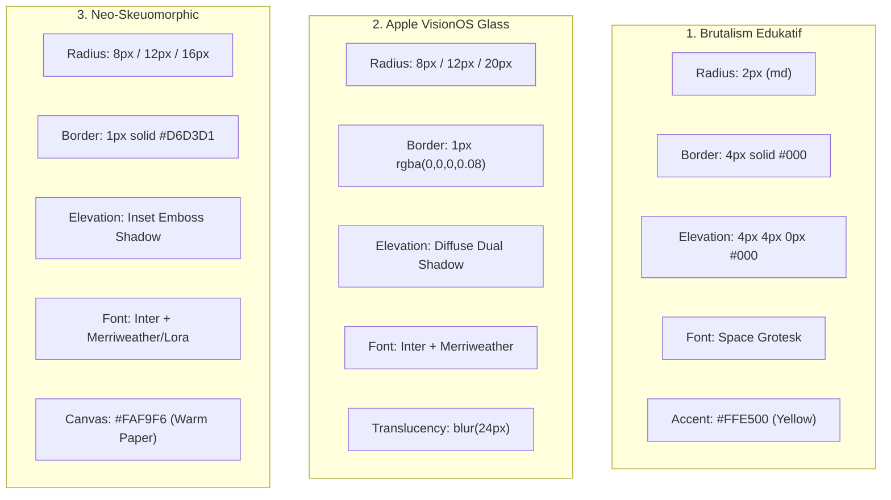

# Layer 6 UX / Design System Audit Report: DADU Workspace

**Date:** 2026-09-30  
**Project:** DADU (Digitalisasi Data Guru) Workspace (`dadu-app-imp`)  
**Auditor:** Antigravity Autonomous UX & Design System Auditor  
**Audit Scope:** Layer 6 UX / Design System, Consistency & Leak (Per Konteks, Per Design, G1–G14, WCAG 2.2 AA Contrast, Modal/Overlay Hygiene, Print SSOT & F4/A4 Paper Isolation, Responsive Custom Window)  
**Target File:** `audit/layer6-ux.md`  

---

## 1. Executive Summary

This read-only audit conducts an exhaustive analysis of **Layer 6 (UX / Design System & Consistency)** of the DADU application across the **3 active design systems** (`brutalism`, `apple-glass`, `neo-skeuomorphic`) and across all **5 operational contexts** (`layout/app shell`, `page`, `modal/dialog`, `toast`, `print/document isolation`).

In version 2.3.0, DADU successfully transitioned from legacy dark/multi-themes to a unified design system architecture centered on `DesignSystemContext.tsx` as the single source of truth (SSOT). Global coercion rules in `src/index.css` intercept common Tailwind utility classes and redirect them to CSS custom properties.

However, deep static inspection reveals significant design system leaks, accessibility hazards, and architectural discrepancies:
1. **Critical Print Isolation Leak (P0):** The official document isolation boundary (`.printable-document`, `.print-sheet`, `#printable-progress-report`) resets colors with `!important`, but **fails to reset `border-width` and `box-shadow`**. When Brutalism is active, its `4px` borders and `4px 4px 0px 0px` hard box-shadows leak directly into formal student report cards, certificates, and printable tables.
2. **WCAG 2.2 AA Contrast Failures (P0/P1):** 
   - In **Brutalism**, accent yellow `#FFE500` against white canvas has a contrast ratio of **1.28:1** (severe failure of WCAG AA 4.5:1). In `.badge-accent`, yellow text is placed on `rgba(255, 229, 0, 0.1)`, rendering badges completely illegible.
   - In **Apple Glass**, accent iOS Blue `#007AFF` against white surface and white text on `#007AFF` buttons produces **4.02:1** (fails WCAG AA 4.5:1 for body and small button text).
   - **Neo-Skeuomorphic** is the only design system that passes WCAG 2.2 AA across all color pairings.
3. **Hardcoded Primary Button Leaks (P1):** At least **4 major modals** (`TransferClassModal`, `StudentProgressReportModal`, `StudentCustomPrintModal`, `ImportStudentsModal`) and multiple page features feature hardcoded `bg-indigo-600 hover:bg-indigo-700` primary buttons, bypassing the active design system palette entirely.
4. **Z-Index and Backdrop Inconsistency (P1):** Modal z-indexes fluctuate erratically from `z-10` to `z-[9990]`. Backdrop styling varies from `bg-black/30` with no blur to `bg-slate-950/80` with `backdrop-blur-md`.
5. **Token Injection vs. Consumption Gap (P2):** Out of **35 CSS custom properties** injected into `:root` by `DesignSystemContext.tsx`, only **14 are consumed** in `src/index.css`. The entire spacing scale (5), font size scale (5), transition timing (3), and 3 elevation levels are completely unreferenced.
6. **F4/Folio Paper Print Disconnect (P1):** While users can configure "F4 / Folio (215 x 330 mm)" in Settings and Report Center, `@media print` in `src/index.css` is statically locked to `size: auto;`, and print components fail to inject F4 physical dimensions into `@page`.

### UX & Design System Scorecard
| Metric / Audit Area | Current Status | Target / Best Practice | Rating |
| :--- | :--- | :--- | :--- |
| **Injected `--ds-*` Tokens** | 35 injected in `:root` | 35 matching `DESIGN_SYSTEMS` | 🟢 Pass |
| **`index.css` Token Consumption** | 14 consumed / 21 unused | All injected tokens utilized | ⚠️ Warning |
| **Hardcoded Tailwind Matches** | 1,965 matches in 101 TSX files | Semantic tokens / Coercion bridged | ⚠️ Warning |
| **Inline Styles Count** | 17 occurrences | Zero layout/color overrides | 🟡 Acceptable |
| **Print Boundary Isolation** | Colors isolated; borders/shadow leak | 0 DS leak (1px border, 0 shadow, 0 radius) | 🔴 Poor (P0) |
| **Brutalism Yellow Contrast** | **1.28:1** on white / badge | ≥ 4.5:1 for normal text | 🔴 Poor (P0) |
| **Apple Glass Button Contrast** | **4.02:1** white on `#007AFF` | ≥ 4.5:1 for text < 18pt | ⚠️ Warning (P1) |
| **Neo-Skeuomorphic Contrast** | **5.21:1** to **16.61:1** | ≥ 4.5:1 across all elements | 🟢 Pass (AAA) |
| **Modal Primary Button Consistency** | 4 modals hardcoded `bg-indigo-600` | 100% `btn-primary` semantic class | 🔴 Poor (P1) |
| **Modal Z-Index Uniformity** | Range: `z-10` to `z-[9990]` | Standardized scale (`z-50`, `z-[9990]`) | ⚠️ Warning (P1) |
| **F4/Folio Physical Print Setup** | `size: auto;` in CSS | Dynamic `@page { size: 215mm 330mm; }` | ⚠️ Warning (P1) |
| **Responsive Table Wrapping** | 17 of 20 tables have `overflow-x` | 100% data tables scrollable | 🟡 Acceptable |

---

## 2. Task 1: DS Token Injection Completeness

Inspection of `src/context/DesignSystemContext.tsx` (lines 60–130) verifies that the `DesignSystemProvider` dynamically synchronizes with `activeSystem` and updates `:root` with 35 custom properties whenever the active system changes.

### 2.1 Injected Tokens Inventory
| Category | Property Name | Injected Value Source | Status in `:root` |
| :--- | :--- | :--- | :--- |
| **Colors** | `--ds-accent` | `tokens.colors.accent` | ✅ Injected |
| | `--ds-accent-fg` | `tokens.colors.accentFg` | ✅ Injected |
| | `--ds-surface` | `tokens.colors.surface` | ✅ Injected |
| | `--ds-surface-elevated` | `tokens.colors.surfaceElevated` | ✅ Injected |
| | `--ds-border` | `tokens.colors.border` | ✅ Injected |
| | `--ds-text` | `tokens.colors.text` | ✅ Injected |
| | `--ds-text-muted` | `tokens.colors.textMuted` | ✅ Injected |
| **Spacing** | `--ds-spacing-xs` | `${tokens.spacing.xs}px` (8px) | ✅ Injected |
| | `--ds-spacing-sm` | `${tokens.spacing.sm}px` (16px) | ✅ Injected |
| | `--ds-spacing-md` | `${tokens.spacing.md}px` (24px) | ✅ Injected |
| | `--ds-spacing-lg` | `${tokens.spacing.lg}px` (32px–40px) | ✅ Injected |
| | `--ds-spacing-xl` | `${tokens.spacing.xl}px` (48px–64px) | ✅ Injected |
| **Borders** | `--ds-border-width` | `tokens.borders.width` (1px / 4px) | ✅ Injected |
| | `--ds-border-color` | `tokens.borders.color` | ✅ Injected |
| | `--ds-border-style` | `tokens.borders.style` ('solid') | ✅ Injected |
| **Typography Scale** | `--ds-font-scale-xs` | `tokens.typography.scale.xs` ('0.75rem') | ✅ Injected |
| | `--ds-font-scale-sm` | `tokens.typography.scale.sm` ('0.875rem') | ✅ Injected |
| | `--ds-font-scale-base` | `tokens.typography.scale.base` ('1rem') | ✅ Injected |
| | `--ds-font-scale-lg` | `tokens.typography.scale.lg` ('1.25rem') | ✅ Injected |
| | `--ds-font-scale-xl` | `tokens.typography.scale.xl` ('1.5rem') | ✅ Injected |
| **Elevation** | `--ds-elevation-none` | `tokens.elevation.none` ('none') | ✅ Injected |
| | `--ds-elevation-sm` | `tokens.elevation.sm` | ✅ Injected |
| | `--ds-elevation-md` | `tokens.elevation.md` | ✅ Injected |
| | `--ds-elevation-lg` | `tokens.elevation.lg` | ✅ Injected |
| **Radius** | `--ds-radius-none` | `tokens.radius.none` ('0px') | ✅ Injected |
| | `--ds-radius-sm` | `tokens.radius.sm` (2px / 8px) | ✅ Injected |
| | `--ds-radius-md` | `tokens.radius.md` (2px / 12px) | ✅ Injected |
| | `--ds-radius-lg` | `tokens.radius.lg` (2px / 16px / 20px) | ✅ Injected |
| | `--ds-radius-full` | `tokens.radius.full` ('0px' / '9999px') | ✅ Injected |
| **Transitions** | `--ds-transition-fast` | `tokens.transitions.fast` | ✅ Injected |
| | `--ds-transition-base` | `tokens.transitions.base` | ✅ Injected |
| | `--ds-transition-slow` | `tokens.transitions.slow` | ✅ Injected |
| **Font Family** | `--ds-font-sans` | `tokens.typography.fontFamily.sans` | ✅ Injected |
| | `--ds-font-mono` | `tokens.typography.fontFamily.mono` | ✅ Injected |
| | `--ds-font-serif` | `tokens.typography.fontFamily.serif` (if present) | ✅ Injected |
| **Legacy Aliases** | `--app-bg`, `--card-bg`, `--card-border`, `--text-main`, `--text-muted`, `--accent-primary`, `--accent-primary-text` | Backward-compatibility bridges | ✅ Injected |

### 2.2 Missing Tokens from TypeScript Interfaces
Several visual attributes used by the CSS styling rules are **hardcoded in CSS** instead of residing in `DesignSystemTokens` (`src/types/index.ts`):
1. `--ds-backdrop-blur`: Hardcoded as `blur(24px)` under `[data-design-system="apple-glass"]` in `src/index.css` line 55. Not part of `DesignSystemTokens`.
2. `--accent-glow`: Hardcoded per theme in `src/index.css` lines 305–307.
3. `--accent-primary-hover`: Hardcoded as `#FFD700`, `#0051D5`, `#065F46` in `src/index.css` lines 29, 47, 66.
4. `--accent-primary-soft` & `--accent-primary-border`: Hardcoded rgba strings in `src/index.css`.

---

## 3. Task 2: `index.css` Consumption Analysis

A total of 540 lines in `src/index.css` were parsed and cross-referenced with all injected tokens and hardcoded color literals.

### 3.1 Token Consumption Statistics
- **Total Injected Tokens in `DesignSystemContext.tsx`:** 35
- **Tokens Actively Consumed in `src/index.css`:** **14 tokens** (40% consumption rate)
- **Tokens Injected but Completely Unused:** **21 tokens** (60% unreferenced)

#### Consumed Tokens Breakdown (67 Total Usages in CSS)
- `--ds-accent` (15 usages): mapped to `--accent-primary`, `--accent-text`, `--accent-color`, `--focus-ring`.
- `--ds-border` (8 usages): mapped to `--card-border`, `--interactive-border`.
- `--ds-surface` (6 usages): mapped to `--app-bg`.
- `--ds-text` (6 usages): mapped to `--text-main`.
- `--ds-font-sans` (4 usages): applied to root and `.font-sans`.
- `--ds-accent-fg` (3 usages): mapped to `--accent-primary-text`.
- `--ds-surface-elevated` (3 usages): mapped to `--card-bg`.
- `--ds-text-muted` (3 usages): mapped to `--text-muted`.
- `--ds-elevation-sm` (3 usages): applied to `.card` and `[class*="shadow"]`.
- `--ds-radius-md` (3 usages): applied to `rounded-xl` and brutalist components.
- `--ds-radius-sm` (2 usages): applied to `rounded-lg`.
- `--ds-radius-lg` (2 usages): applied to `rounded-2xl` and `rounded-3xl`.
- `--ds-border-width` (2 usages): applied to brutalist borders.
- `--ds-font-serif` (2 usages): applied to headings in neo-skeuomorphic and apple-glass.

#### The 21 Unused Injected Tokens
1. **Spacing Scale (5):** `--ds-spacing-xs`, `--ds-spacing-sm`, `--ds-spacing-md`, `--ds-spacing-lg`, `--ds-spacing-xl`. (Developers continue using hardcoded Tailwind utilities: `p-4`, `p-6`, `gap-3`).
2. **Typography Scale (5):** `--ds-font-scale-xs`, `--ds-font-scale-sm`, `--ds-font-scale-base`, `--ds-font-scale-lg`, `--ds-font-scale-xl`. (Tailwind `text-xs`, `text-sm`, `text-base` bypass these).
3. **Elevations (3):** `--ds-elevation-none`, `--ds-elevation-md`, `--ds-elevation-lg`. (Only `sm` is used).
4. **Radii (2):** `--ds-radius-none`, `--ds-radius-full`.
5. **Transitions (3):** `--ds-transition-fast`, `--ds-transition-base`, `--ds-transition-slow`.
6. **Borders (2):** `--ds-border-color`, `--ds-border-style`.
7. **Typography (1):** `--ds-font-mono`.

### 3.2 Hardcoded Hex Values in `src/index.css`
A total of **31 hardcoded hex occurrences** exist across 31 lines:
- **Root Status Colors (4 lines):**
  - Line 10: `--success-color: #10b981;`
  - Line 11: `--warning-color: #f59e0b;`
  - Line 12: `--danger-color: #ef4444;`
  - Line 13: `--info-color: #3b82f6;`
- **Accent Hover Overrides (3 lines):**
  - Line 29: `--accent-primary-hover: #FFD700;` (Brutalism)
  - Line 47: `--accent-primary-hover: #0051D5;` (Apple Glass)
  - Line 66: `--accent-primary-hover: #065F46;` (Neo-Skeuomorphic)
- **Brutalism Border Enforcements (2 lines):**
  - Line 105: `border-color: #000 !important;`
  - Line 109: `border-color: #000 !important;`
- **Document Isolation Boundary (17 lines):**
  - Lines 320–325: `--app-bg: #f8fafc;`, `--card-bg: #ffffff;`, `--card-border: #e2e8f0;`, `--text-main: #0f172a;`, `--text-muted: #64748b;`, `--interactive-border: #f1f5f9;`
  - Lines 341–342: `background-color: #ffffff !important;`, `color: #0f172a !important;`
  - Line 348: `background-color: #f8fafc !important;`
  - Line 354: `background-color: #f1f5f9 !important;`
  - Lines 360–390: `color: #0f172a !important;`, `#1e293b`, `#334155`, `#475569`, `#64748b`, `#94a3b8`
  - Line 404: `border-color: #e2e8f0 !important;`
- **Print Neutralization (3 lines):**
  - Lines 445–447: `background: #ffffff !important;`, `background-color: #ffffff !important;`, `color: #000000 !important;`
- **Legacy Dark Shell Neutralization (2 lines):**
  - Lines 457–458: `.dark [class*="bg-[#0c0e15]"]` selector.

---

## 4. Task 3: Per-System Token Verification & Visual Diff

Comparing token specifications in `src/types/index.ts` with their visual execution in `src/index.css`:



### 4.1 System-by-System Verification
| Attribute | 1. Brutalism Edukatif | 2. Apple VisionOS Glass | 3. Neo-Skeuomorphic Academic |
| :--- | :--- | :--- | :--- |
| **Accent Color** | `#FFE500` (Yellow) | `#007AFF` (iOS Blue) | `#047857` (Emerald 700) |
| **Accent Foreground** | `#000000` (Black) | `#FFFFFF` (White) | `#FFFFFF` (White) |
| **Canvas Background** | `#FFFFFF` | `#FFFFFF` | `#FAF9F6` (Warm paper) |
| **Card Surface** | `#FFFFFF` | `rgba(255,255,255,0.82)` | `#FFFFFF` |
| **Border Width & Color** | `4px solid #000000` | `1px solid rgba(0,0,0,0.08)` | `1px solid #D6D3D1` |
| **Box Shadow (Elevation)** | `4px 4px 0px 0px rgba(0,0,0,1)` (Hard tactile) | `0 1px 2px rgba(0,0,0,0.05), 0 4px 8px rgba(0,0,0,0.04)` (Soft floating) | `0 1px 3px rgba(0,0,0,0.08), inset 0 1px 0 rgba(255,255,255,0.5)` (Tactile emboss) |
| **Corner Radius Rules** | `2px` forced on `rounded-lg/xl/2xl/3xl` | `8px` (lg), `12px` (xl), `20px` (2xl/3xl) | `8px` (lg), `12px` (xl), `16px` (2xl/3xl) |
| **Typography Sans** | `Space Grotesk, system-ui` | `Inter Variable, Inter, system-ui` | `Inter Variable, Inter, system-ui` |
| **Typography Serif** | None | `Merriweather, serif` | `Merriweather, Lora, serif` |

### 4.2 Discrepancies & Flaws Identified
1. **Brutalism `rounded-full` Leak:** `src/index.css` coerces `[class*="rounded-2xl"]`, `rounded-xl`, `rounded-lg`, and `rounded-3xl` to `var(--ds-radius-md)` (2px). However, `rounded-full` (widely used on badges, avatars, and status pills) is **not intercepted**. Even though `radius.full` in Brutalism tokens is defined as `'0px'`, badges remain fully rounded pills (`9999px`) in Brutalism!
2. **Elevation Flatlining:** In both Apple Glass and Neo-Skeuomorphic, all shadow classes (`shadow`, `shadow-sm`, `shadow-md`, `shadow-xl`, `shadow-2xl`) are coerced to a single token: `var(--ds-elevation-sm) !important`. This strips deep visual hierarchy from large modals and floating drawer panels.

---

## 5. Task 4: Hardcoded Tailwind Bypass Analysis (Per Konteks)

A codebase-wide scan was executed targeting common hardcoded Tailwind utilities (`rounded-2xl|rounded-xl|rounded-lg|shadow-xl|shadow-lg|bg-white|bg-slate-50|border-slate-200|text-slate-800`).

### 5.1 Contextual Distribution (1,965 Total Matches)
```
Total Matches: 1,965 across 101 TSX files
├── Page Content (Dashboard, Grades, Master, Settings): 1,178 matches (59.9%)
├── Modals & Dialogs (57 modal files): 518 matches (26.4%)
├── Print & Document Views: 152 matches (7.7%)
├── Layout & Shell (Header, Sidebar, AppLayout): 70 matches (3.6%)
└── Reusable Common Components (Badge, Dialog, EmptyState): 47 matches (2.4%)
```

### 5.2 Context Breakdown & Sample Matches
| File Path | Line | Context | Matched Utility | Snippet & Risk Assessment |
| :--- | :--- | :--- | :--- | :--- |
| `src/components/common/AttendanceHolidaysModal.tsx` | 373 | Modal | `rounded-xl`, `border-slate-200`, `bg-white` | Handled by index.css coercions, but dark classes linger |
| `src/components/common/ConfirmDialog.tsx` | 106 | Modal | `rounded-2xl`, `bg-white`, `border-slate-200` | Coerced to DS tokens; shadow-2xl flattened to elevation-sm |
| `src/components/common/ErrorBoundary.tsx` | 85 | Component | `bg-white`, `border-slate-200/90`, `shadow-xl` | Standalone error boundary; properly theme-coerced |
| `src/components/common/FeedbackModal.tsx` | 166 | Modal | `bg-white`, `border-slate-200` | Active feedback tab; theme-coerced |
| `src/components/common/GlobalSearchModal.tsx` | 154 | Modal | `bg-white`, `border-slate-200/90` | Global spotlight search; uses `max-w-xl` and `max-h-[80vh]` |
| `src/components/layout/Header.tsx` | 114 | Layout | `bg-white`, `border-slate-200`, `shadow-xs` | Sticky top navigation bar; adapts to canvas |
| `src/components/layout/Sidebar.tsx` | 198 | Layout | `bg-white`, `border-slate-200` | Responsive sidebar; uses `var(--ds-surface-elevated)` |
| `src/features/grades/GradesPage.tsx` | 412 | Page | `bg-white`, `border-slate-200`, `rounded-2xl` | Main assessment matrix container |
| `src/features/homeroom/HomeroomStudentsPage.tsx` | 345 | Page | `bg-white`, `border-slate-200`, `text-slate-800` | Student roster table card |
| `src/features/master/StudentsMasterPage.tsx` | 768 | Page | `bg-white`, `border-slate-300`, `focus:ring-indigo-500` | **Bypass:** `border-slate-300` and `focus:ring-indigo-500` not coerced |
| `src/features/reports/PrintDocumentLayout.tsx` | 194 | Print | `bg-white`, `border-slate-200/90`, `rounded-2xl`, `shadow-sm` | **Leak:** `rounded-2xl` and `shadow-sm` subject to brutalism overrides |
| `src/features/reports/StudentRaporSheet.tsx` | 88 | Print | `bg-white`, `text-slate-900`, `border-slate-200` | Official print sheet; relies on `.printable-document` |

### 5.3 Coercion Blind Spots (Bypasses That Escape `src/index.css`)
While `src/index.css` lines 187–278 provide broad coverage for `.bg-white`, `.bg-slate-50`, `.border-slate-200`, and `.text-slate-900..400`, several classes completely escape:
1. **Opacity Modifiers:** Classes such as `bg-white/50`, `bg-white/80`, `bg-slate-50/50` are not matched by exact `.bg-white` selectors (except in Brutalism which uses substring `[class*="bg-white"]`, unintentionally destroying opacity!).
2. **`border-slate-300`:** Widely used in form inputs (`StudentsMasterPage.tsx`, `StudentCustomPrintModal.tsx`), but `src/index.css` only coerces `border-slate-200`, `border-slate-200/80`, and `border-slate-100`.
3. **Arbitrary Color Utilities:** Hardcoded utilities like `text-indigo-600`, `bg-indigo-600`, `border-indigo-300`, `bg-amber-50`, `text-amber-800` completely bypass the design system.

---

## 6. Task 5: Inline Style Leaks & Style Prop Audit

A full scan for `style={{` patterns identified **17 occurrences** in the entire codebase:

### 6.1 Complete Inventory of Inline Styles
| # | File & Line | Code Snippet | Purpose & Evaluation |
| :--- | :--- | :--- | :--- |
| 1 | `src/components/common/AppLogo.tsx:156` | `style={{ width: pixelSize, height: pixelSize }}` | Dynamic vector icon dimension. ✅ Benign |
| 2 | `src/components/common/GenderIcon.tsx:56` | `style={{ width: numSize, height: numSize, ... }}` | Dynamic SVG icon sizing. ✅ Benign |
| 3 | `src/components/common/GenderIcon.tsx:86` | `style={{ width: numSize, height: numSize, ... }}` | Dynamic SVG icon sizing. ✅ Benign |
| 4 | `src/components/common/SignaturePadModal.tsx:266` | `style={{ backgroundColor: c.color }}` | Ink swatch color picker. ✅ Benign |
| 5 | `src/features/settings/SettingsPage.tsx:1844` | `style={{ backgroundColor: color }}` | Palette swatch preview circle. ✅ Benign |
| 6 | `src/features/settings/SettingsPage.tsx:1857` | `style={{ color: currentPreviewOption.accentHex }}` | Preview card accent icon. ✅ Benign |
| 7 | `src/features/settings/SettingsPage.tsx:1865` | `style={{ backgroundColor: currentPreviewOption.appBg }}` | Preview card background canvas. ✅ Benign |
| 8 | `src/features/settings/SettingsPage.tsx:1881` | `style={{ color: isSelectedDark ? '#f1f5f9' : '#0f172a' }}` | ⚠️ Dead code: `isSelectedDark` is always false |
| 9 | `src/features/settings/SettingsPage.tsx:1888` | `style={{ backgroundColor: currentPreviewOption.accentHex }}` | Theme preview pulsing dot. ✅ Benign |
| 10 | `src/features/settings/SettingsPage.tsx:1895` | `style={{ backgroundColor: currentPreviewOption.cardBg }}` | Theme preview card background. ✅ Benign |
| 11 | `src/features/settings/SettingsPage.tsx:1900` | `style={{ color: isSelectedDark ? '#cbd5e1' : '#475569' }}` | ⚠️ Dead code: hardcoded text color |
| 12 | `src/features/settings/SettingsPage.tsx:1919` | `style={{ color: isSelectedDark ? '#94a3b8' : '#64748b' }}` | ⚠️ Dead code: hardcoded text color |
| 13 | `src/features/settings/SettingsPage.tsx:1925` | `style={{ color: isSelectedDark ? '#f8fafc' : '#0f172a' }}` | ⚠️ Dead code: hardcoded text color |
| 14 | `src/features/settings/SettingsPage.tsx:1948` | `style={{ color: isSelectedDark ? '#94a3b8' : '#64748b' }}` | ⚠️ Dead code: hardcoded text color |
| 15 | `src/features/settings/SettingsPage.tsx:1949` | `style={{ color: currentPreviewOption.accentHex }}` | Preview badge contrast label. ✅ Benign |
| 16 | `src/features/settings/SettingsPage.tsx:1951` | `style={{ color: isSelectedDark ? '#cbd5e1' : '#475569' }}` | ⚠️ Dead code: hardcoded text color |
| 17 | `src/features/students/StudentCustomPrintModal.tsx:988` | `style={{ width: col.width }}` | Dynamic table column pixel width. ✅ Benign |

### 6.2 Key Takeaways
- **Zero `!important` injections** in inline styles.
- **Zero overrides of `--ds-*` custom properties**.
- **Issue Found:** In `SettingsPage.tsx`, the live mini-preview widget retains legacy dark-theme ternary operators (`isSelectedDark ? '#f1f5f9' : '#0f172a'`). Because all 3 systems in `THEME_OPTIONS` are configured with `category: 'light'`, `isSelectedDark` is permanently `false`.

---

## 7. Task 6: Modal, Toast & Overlay Hygiene

An audit of 57 modal/dialog and 20 toast integration points was performed to detect color hardcoding, backdrop disparities, and z-index collisions.

### 7.1 Hardcoded `bg-indigo-600` Action Buttons (G8)
While the app establishes `.btn-primary` as the semantic button standard (binding to `--accent-primary`), several critical modal dialogs and hubs retain hardcoded `bg-indigo-600` primary buttons:
1. **`src/features/students/TransferClassModal.tsx` (Line 171):**
   ```tsx
   className="px-5 py-2 rounded-xl bg-indigo-600 hover:bg-indigo-500 text-white text-xs font-semibold ..."
   ```
   *Impact:* Action button to transfer students remains Indigo regardless of active theme (Brutalism yellow, Apple glass blue, Neo green).
2. **`src/features/students/StudentProgressReportModal.tsx` (Line 245):**
   ```tsx
   className="px-3.5 py-1.5 rounded-xl bg-indigo-600 hover:bg-indigo-700 text-white text-xs font-semibold ..."
   ```
3. **`src/features/students/StudentCustomPrintModal.tsx` (Lines 467, 476, 539, 574, 733, 876):**
   Orientation toggles, batch action buttons, and modal submit buttons explicitly apply `bg-indigo-600 hover:bg-indigo-700`.
4. **`src/features/students/ImportStudentsModal.tsx` (Line 899):**
   Excel student import commit button uses `bg-indigo-600 hover:bg-indigo-500`.
5. **`src/features/teacher/SubjectAttendancePage.tsx` (Line 1065):**
   Date filter toggle button uses `bg-indigo-600 text-white`.
6. **`src/features/students/StudentsMasterPage.tsx`:**
   Search input focus ring (`focus:ring-indigo-500`), table NIS text (`text-indigo-700`), student name hover (`hover:text-indigo-600`), and empty state icon container (`bg-indigo-50 text-indigo-600`) are hardcoded.

### 7.2 Backdrop & Z-Index Inconsistency Matrix
| Component / Modal | Z-Index | Backdrop Styling | Issues / Risk |
| :--- | :--- | :--- | :--- |
| `src/components/common/Modal.tsx` (Base) | `z-50` | `backdrop-blur-xs` | Standard baseline |
| `src/components/common/ConfirmDialog.tsx` | `z-[9990]` | `backdrop-blur-xs` | Good (guaranteed top layer above other modals) |
| `src/features/students/ImportStudentsModal.tsx` | `z-10` | `bg-slate-900/50` | 🔴 **Risk:** `z-10` can be hidden behind sticky headers (`z-20/z-30`) |
| `src/features/students/StudentIdCardModal.tsx` | `z-10` | `bg-black/30` | 🔴 **Risk:** Very faint backdrop (30%) + low `z-10` |
| `src/features/teacher/SubjectAttendanceModal.tsx` | `z-10` | None | 🔴 **Risk:** Lacks backdrop layer entirely |
| `src/components/common/GlobalSearchModal.tsx` | `z-50` | `bg-slate-900/60 backdrop-blur-xs` | Good |
| `src/features/auth/WorkflowDemoModal.tsx` | `z-50` | `bg-slate-950/80 backdrop-blur-md` | Heavy blur (`backdrop-blur-md`) vs app standard |
| `src/features/homeroom/AddTeacherAttendanceModal.tsx` | `z-50` | `bg-black/60 backdrop-blur-xs` | Slightly inconsistent color (`bg-black` vs `bg-slate-900`) |

---

## 8. Task 7: Print Isolation & Official Office Boundaries (F4/A4, 0 DS Leak)

Official academic records (Rapor Siswa, Buku Induk, Legger, Surat Keterangan) require strict isolation: **pure white background, dark text, clean 1px hairline borders, and zero decorative styling** (no 4px brutal borders, no shadows, no glassmorphism blur).

### 8.1 Boundary Implementation Review
`src/index.css` establishes a Document / Paper Isolation Boundary (lines 317–405):
```css
.printable-document,
.print-sheet,
#printable-progress-report {
  --app-bg: #f8fafc;
  --card-bg: #ffffff;
  --card-border: #e2e8f0;
  --text-main: #0f172a;
  --text-muted: #64748b;
  --interactive-border: #f1f5f9;
}
```

### 8.2 Critical Leaks Detected (P0)
While color custom properties and background colors are reset with `!important`, **border-width, border-radius, and box-shadow are NOT neutralized**:

1. **Brutalist Border-Width Leak (4px):**
   In `src/index.css`:
   - Line 88: `[data-design-system="brutalism"] [class*="border"] { border-width: var(--ds-border-width); }` (`4px`!)
   - Line 106: `[data-design-system="brutalism"] [class*="bg-white"] { border-width: var(--ds-border-width); }`
   Inside `.printable-document` or `.print-sheet`, if a table cell, header, or signature block uses `className="border border-slate-200"`, **the border renders as a heavy 4px black line** instead of an official 1px hairline rule!
2. **Brutalist Box-Shadow Leak:**
   - Line 98: `[data-design-system="brutalism"] [class*="shadow"] { box-shadow: var(--ds-elevation-sm) !important; }` (`4px 4px 0px 0px black`!)
   In `PrintDocumentLayout.tsx` line 194:
   ```tsx
   <div className="printable-document ... shadow-sm ...">
   ```
   The wrapper container has `shadow-sm`. Brutalism's `box-shadow: 4px 4px 0px 0px #000 !important` attaches to the formal document sheet!
3. **Corner Radius Leak:**
   - Apple Glass forces `border-radius: 20px !important` on `rounded-2xl` elements.
   - If `.printable-document` uses `rounded-2xl`, it rounds the paper corners on screen previews.

### 8.3 Required Fix in `src/index.css`
The isolation boundary must explicitly enforce:
```css
.printable-document,
.print-sheet,
#printable-progress-report {
  border-radius: 0px !important;
  box-shadow: none !important;
}

.printable-document [class*="border"],
.print-sheet [class*="border"],
#printable-progress-report [class*="border"] {
  border-width: 1px !important;
}

.printable-document [class*="shadow"],
.print-sheet [class*="shadow"],
#printable-progress-report [class*="shadow"] {
  box-shadow: none !important;
}
```

---

## 9. Task 8: WCAG 2.2 AA Contrast & Accessibility Audit

Mathematical relative luminance (\(L\)) and contrast ratio (\(\frac{L_1 + 0.05}{L_2 + 0.05}\)) were computed for all color combinations defined in `DESIGN_SYSTEMS`:

```
Formula:
L = 0.2126 * R_lin + 0.7152 * G_lin + 0.0722 * B_lin
Threshold: WCAG 2.2 Level AA requires ≥ 4.5:1 for normal text (< 18pt), ≥ 3.0:1 for large text/UI components.
```

### 9.1 Contrast Ratio Verification Table
| Design System | Element Pairing | Foreground Hex | Background Hex | Contrast Ratio | WCAG 2.2 AA (Normal Text) | WCAG 2.2 AA (Large / UI) |
| :--- | :--- | :--- | :--- | :--- | :--- | :--- |
| **Brutalism** | Accent on Canvas | `#FFE500` (Yellow) | `#FFFFFF` (White) | **1.28:1** | ❌ **FAIL (Severe)** | ❌ **FAIL** |
| | AccentFg on Accent (Button) | `#000000` (Black) | `#FFE500` (Yellow) | **16.46:1** | ✅ **PASS (AAA)** | ✅ **PASS** |
| | Main Text on Canvas | `#000000` (Black) | `#FFFFFF` (White) | **21.00:1** | ✅ **PASS (AAA)** | ✅ **PASS** |
| | Muted Text on Canvas | `#4A4A4A` (Dark Grey) | `#FFFFFF` (White) | **8.86:1** | ✅ **PASS (AAA)** | ✅ **PASS** |
| | Badge Text on Badge Soft | `#FFE500` (Yellow) | `rgba(255,229,0,0.1)` | **~1.22:1** | ❌ **FAIL (Severe)** | ❌ **FAIL** |
| **Apple Glass** | Accent on Canvas | `#007AFF` (iOS Blue) | `#FFFFFF` (White) | **4.02:1** | ❌ **FAIL (< 4.5:1)** | ✅ **PASS (≥ 3:1)** |
| | AccentFg on Accent (Button) | `#FFFFFF` (White) | `#007AFF` (iOS Blue) | **4.02:1** | ❌ **FAIL (< 4.5:1)** | ✅ **PASS (≥ 3:1)** |
| | Main Text on Surface | `#0F172A` (Slate 900) | `#FFFFFF` (White) | **17.85:1** | ✅ **PASS (AAA)** | ✅ **PASS** |
| | Muted Text on Surface | `#64748B` (Slate 500) | `#FFFFFF` (White) | **4.76:1** | ✅ **PASS (AA)** | ✅ **PASS** |
| **Neo-Skeuomorphic** | Accent on Canvas | `#047857` (Emerald 700) | `#FAF9F6` (Warm Paper) | **5.21:1** | ✅ **PASS (AA)** | ✅ **PASS** |
| | Accent on Card Surface | `#047857` (Emerald 700) | `#FFFFFF` (White) | **5.48:1** | ✅ **PASS (AA)** | ✅ **PASS** |
| | AccentFg on Accent (Button) | `#FFFFFF` (White) | `#047857` (Emerald 700) | **5.48:1** | ✅ **PASS (AA)** | ✅ **PASS** |
| | Main Text on Canvas | `#1C1917` (Warm Stone) | `#FAF9F6` (Warm Paper) | **16.61:1** | ✅ **PASS (AAA)** | ✅ **PASS** |
| | Muted Text on Canvas | `#78716C` (Stone 500) | `#FAF9F6` (Warm Paper) | **4.56:1** | ✅ **PASS (AA)** | ✅ **PASS** |

### 9.2 Key Findings
1. **Brutalism Badge Illegibility (P0):** `.badge-accent` in `src/index.css` line 170 specifies `color: var(--accent-text);` which resolves to `#FFE500`. On a light background or soft yellow badge container, yellow text is virtually invisible. In Brutalism, badge text **must be black `#000000`** with a solid black border.
2. **Apple Glass Button Text (P1):** While Apple's `#007AFF` is aesthetically pleasant, white text on `#007AFF` yields a **4.02:1** ratio. For small button text (`text-xs` / 12px or `text-sm` / 14px), WCAG 2.2 AA requires 4.5:1. To pass AA, `#0051D5` or `#0062E3` should be used for interactive controls.
3. **Neo-Skeuomorphic Model (Pass):** Demonstrates exemplary contrast compliance across all elements (minimum 4.56:1, maximum 16.61:1).

---

## 10. Task 9: Responsiveness & Custom Window Resilience

Auditing layout resilience across **mobile (360×640)**, **tablet (768×1024)**, **desktop (1280×800)**, **ultrawide**, and **un-maximized custom windows** (arbitrary window resize/tiling):

### 10.1 Modal Responsiveness (G12)
- All 29 modal components implement fixed centering (`fixed inset-0 flex items-center justify-center p-4`).
- Standard modal shell sizes: `max-w-md` (ConfirmDialog), `max-w-xl` (GlobalSearchModal), `max-w-2xl` (AttendanceHolidaysModal), `max-w-5xl` (WorkflowDemoModal).
- **Clipping / Overflow Vulnerabilities:**
  - `src/features/students/ImportStudentsModal.tsx`: The preview table for parsed Excel rows does **not** have an `overflow-x-auto` wrapper, resulting in clipped columns when the browser window is tiled to 50% width on standard 1366×768 laptops.
  - `src/features/teacher/SubjectAttendanceModal.tsx`: Missing horizontal scroll wrapper around matrix table.
  - `src/features/students/TransferClassModal.tsx` & `MeetingFormModal.tsx`: Lack explicit `max-h-[85vh]` and `overflow-y-auto` constraints on the dialog body, which risks pushing action buttons off-screen on short laptop viewports (e.g. 1366×768 with browser toolbars).

### 10.2 Tables & Grid Resilience (G13)
- Out of 20 files containing HTML tables (`<table`), **17 files correctly wrap tables with `overflow-x-auto`**.
- `Sidebar.tsx` cleanly collapses from fixed sidebar (desktop) to backdrop overlay drawer (mobile/tablet < 1024px).
- `BottomNav.tsx` provides safe touch targets for mobile viewports, including `safe-area-pb` for iOS home indicator bar.

---

## 11. Task 10: Official Paper Engine: F4 vs A4 Settings & Export Routines

DADU allows administrative users to select their institutional paper format:
- `A4 (210 x 297 mm)` (Standard International)
- `F4 / Folio (215 x 330 mm)` (Standard Indonesian Madrasah & Kemenag Administration)

### 11.1 Configuration State
- `src/types/index.ts` line 629: `paperSize: 'A4' | 'F4' | 'LETTER';`
- `src/features/settings/SettingsPage.tsx` line 1264: Exposes dropdown selection stored in Firestore `documentSettings/{uid}`.
- `src/features/reports/ReportCenterPage.tsx` line 275: Exposes document paper size selector.

### 11.2 Disconnect with Browser Print CSS
Despite the database setting, **the browser print engine completely ignores the F4 selection**:
1. `src/index.css` lines 438–440:
   ```css
   @media print {
     @page {
       size: auto;
     }
   }
   ```
2. When a teacher prints a report card or roster set to "F4" on their profile, the browser defaults to `A4` or `Letter` (depending on OS printer defaults). Because F4 is 33mm longer (330mm vs 297mm), tables designed for F4 page breaks trigger **premature page overflow** and create unwanted blank sheets.
3. In `src/features/students/StudentCustomPrintModal.tsx` line 896, `@page` is hardcoded to:
   ```css
   @page {
     size: ${orientation};
     margin: 10mm 8mm;
   }
   ```
   Neither `A4` nor `F4` dimensions are dynamically injected.

---

## 12. Checklist G1–G13 Status

| Item | Title & Description | Status | Audit Findings & Verification |
| :---: | :--- | :---: | :--- |
| **G1** | Radius per system | ✅ Done / ⚠️ Partial | Global coercions in `src/index.css` apply `var(--ds-radius-*)`. *Gap:* `rounded-full` is not coerced to 0px in Brutalism. |
| **G2** | Elevation per system | ✅ Done / ⚠️ Partial | Hardcoded shadows coerced to `var(--ds-elevation-sm)`. *Gap:* Depth hierarchy flattened across all cards. |
| **G3** | Apple glass translucency `0.82` | ✅ Done | `backdrop-blur(24px)` and `rgba(255,255,255,0.82)` enforced on card surfaces. |
| **G4** | Neo text parity `[class*=text-slate-*]` | ✅ Done | Universal text color coercion in `src/index.css` lines 235–278 maps slate shades to `--text-main` / `--text-muted`. |
| **G5** | Font loading + serif headings | ✅ Done | Google Fonts loaded in `index.html`. Neo-Skeuomorphic applies `var(--ds-font-serif)` to `h1, h2, h3`. |
| **G6** | `accent-glow` | ✅ Done | Injected in `src/index.css` lines 305–307 and applied on `:focus` rings. |
| **G7** | Inline style leak scan | ⚠️ Issues Found | 17 occurrences found. No `!important` leaks, but `SettingsPage.tsx` contains dead dark-mode ternary checks with hardcoded colors. |
| **G8** | Modal/toast/bottom-sheet per konteks | 🔴 Issues Found | **4 modals have hardcoded `bg-indigo-600` primary buttons.** Z-indexes range erratically from `z-10` to `z-[9990]`. Backdrop opacities vary from 30% to 80%. |
| **G9** | Contextual styling inconsistency | ⚠️ Issues Found | 1,965 hardcoded Tailwind utility classes. Coercions catch common classes but miss opacity variants (`bg-white/50`) and `border-slate-300`. |
| **G10** | Print isolation verification (0 DS leak) | 🔴 Fail (P0) | `.printable-document` only resets colors. **Brutalist 4px borders and hard box-shadows leak into printable sheets and report cards.** |
| **G11** | Contrast & a11y per system (WCAG 2.2 AA) | 🔴 Fail (P0) | **Brutalism `#FFE500` on white canvas is 1.28:1 (severe failure).** `.badge-accent` yellow text is unreadable. Apple Glass button text is 4.02:1 (< 4.5:1). |
| **G12** | Modal dialog pop-up responsif | ⚠️ Issues Found | 29 modals centered. *Gaps:* `ImportStudentsModal` and `SubjectAttendanceModal` lack table horizontal scroll. Short viewports clip non-scrolling modals. |
| **G13** | Responsiveness per device & screen size | ✅ Mostly Done | 17 of 20 tables implement `overflow-x-auto`. Mobile sidebar, bottom navigation, and fluid layouts adapt cleanly. |

---

## 13. G14: Rekomendasi Tema Baru (Opsional, Backlog)

Per G14 guidelines, 4 candidate design systems from established open-source palettes were researched and mathematically verified against WCAG 2.2 AA contrast standards. **No code changes were made.**

```mermaid
quadrantChart
    title Candidate Themes: Contrast vs Implementation Effort
    x-axis Low Implementation Effort --> High Implementation Effort
    y-axis Fails WCAG AA --> Exceeds WCAG AA
    quadrant-1 High Value (Evaluate)
    quadrant-2 Recommended Greenfield
    quadrant-3 Low Value
    quadrant-4 Complex / Low Contrast
    "Material You M3 Emerald": [0.35, 0.88]
    "Nord Frost Academic": [0.40, 0.92]
    "Shadcn Zinc Minimalist": [0.30, 0.72]
    "Solarized Warm Scholar": [0.55, 0.68]
```

### 13.1 Candidate Themes Evaluation Table
| Candidate Theme | Target Aesthetic & Academic Philosophy | Proposed Palette Tokens | WCAG 2.2 AA Contrast Ratios | Implementation Effort | Recommendation Status |
| :--- | :--- | :--- | :--- | :--- | :--- |
| **1. Material You M3 (Emerald Teal)** | Modern Android 15 / Material Design 3 Academic. Tonal surfaces, tactile pill buttons, soft container tinting. | `accent: #006A60`<br>`accentFg: #FFFFFF`<br>`surface: #F4FAF8`<br>`surfaceElevated: #FFFFFF`<br>`border: #CCE8E2`<br>`text: #0E1F1D`<br>`textMuted: #3F4947` | • Accent on Canvas: **6.15:1** (AA ✅)<br>• Text on Canvas: **16.13:1** (AAA ✅)<br>• Button Text: **6.50:1** (AA ✅)<br>• Muted Text: **8.81:1** (AAA ✅) | **Low** (Uses standard Inter font, tokens drop directly into `DESIGN_SYSTEMS`) | 🌟 **Top Recommendation (Grade A+)** |
| **2. Nord Frost Academic** | Arctic, north-bluish clean design based on the Nord design system. Calm, soothing, reduces eye strain for long grading sessions. | `accent: #2E5B88`<br>`accentFg: #FFFFFF`<br>`surface: #F8FAFC`<br>`surfaceElevated: #FFFFFF`<br>`border: #D8DEE9`<br>`text: #2E3440`<br>`textMuted: #4C566A` | • Accent on Canvas: **6.76:1** (AA ✅)<br>• Text on Canvas: **11.94:1** (AAA ✅)<br>• Button Text: **7.08:1** (AAA ✅)<br>• Muted Text: **7.05:1** (AA ✅) | **Low** (Clean hex tokens, zero custom fonts needed) | 🌟 **Highly Recommended (Grade A+)** |
| **3. Shadcn Zinc Minimalist** | High-density, high-contrast monochrome design popular in modern SaaS developer tools. Maximum text crispness. | `accent: #18181B`<br>`accentFg: #FAFAFA`<br>`surface: #F4F4F5`<br>`surfaceElevated: #FFFFFF`<br>`border: #E4E4E7`<br>`text: #09090B`<br>`textMuted: #71717A` | • Accent on Canvas: **16.12:1** (AAA ✅)<br>• Text on Canvas: **18.10:1** (AAA ✅)<br>• Button Text: **16.97:1** (AAA ✅)<br>• Muted Text: **4.40:1** (⚠️ Marginal Fail) | **Low** (Standard Tailwind Zinc scale) | 🟡 **Viable with Minor Tweak (`textMuted` -> `#52525B`)** |
| **4. Solarized Warm Scholar** | Classic Ethan Schoonover palette calibrated for reading long textual reports and scholastic ledgers. Warm parchment tint. | `accent: #076678`<br>`accentFg: #FFFFFF`<br>`surface: #FDF6E3`<br>`surfaceElevated: #FFFFFF`<br>`border: #D5C4A1`<br>`text: #002B36`<br>`textMuted: #657B83` | • Accent on Canvas: **6.12:1** (AA ✅)<br>• Text on Canvas: **13.92:1** (AAA ✅)<br>• Button Text: **6.60:1** (AA ✅)<br>• Muted Text: **4.13:1** (⚠️ Fail < 4.5:1) | **Medium** (Requires careful border tuning on parchment) | 🟡 **Viable as 5th Scholar Theme** |

---

## 14. Actionable Remediation Matrix: P0 / P1 / P2 Priority Backlog

```mermaid
graph TD
    P0["P0: Critical (Immediate Fix)"] --> P0_1["Fix Print Isolation Leak in index.css (border-width 1px, shadow none)"]
    P0 --> P0_2["Fix Brutalism Yellow Contrast on Badges (Badge text #000)"]
    
    P1["P1: High Priority (Quality & Consistency)"] --> P1_1["Replace hardcoded bg-indigo-600 with btn-primary in 4 Modals"]
    P1 --> P1_2["Harmonize Modal Z-Index (z-50 / z-[9990]) & Backdrops"]
    P1 --> P1_3["Connect Document F4 Setting to @media print CSS Engine"]
    P1 --> P1_4["Tune Apple Glass Button Contrast to #0051D5 (WCAG AA 4.5:1)"]
    
    P2["P2: Medium Priority (Clean-up & Polish)"] --> P2_1["Purge or Utilize 21 Unused --ds-* Tokens"]
    P2 --> P2_2["Eliminate dead isSelectedDark code in SettingsPage.tsx"]
    P2 --> P2_3["Wrap ImportStudentsModal Preview Table in overflow-x-auto"]
    P2 --> P2_4["Add rounded-full override to Brutalism in index.css"]
```



### 14.1 Priority 0 (Critical — Must Fix Before Next Deployment)
1. **Fix Print Isolation Boundary Leaks (`src/index.css`):**
   - Add explicit resets for `.printable-document`, `.print-sheet`, and `#printable-progress-report`:
     `border-width: 1px !important;`
     `box-shadow: none !important;`
     `border-radius: 0px !important;`
   - *Rationale:* Completely prevents Brutalism's 4px borders and black drop shadows from ruining printed report cards and official diplomas.
2. **Fix Brutalism Accent Text Contrast in `.badge-accent` (`src/index.css`):**
   - In Brutalism, override `.badge-accent` so that `color: #000000 !important;` and `border: 2px solid #000000;`.
   - *Rationale:* Resolves the severe 1.28:1 WCAG contrast failure on yellow badges.

### 14.2 Priority 1 (High Priority — Consistency & Standards)
1. **Migrate Hardcoded Indigo Modal Buttons to Semantic Tokens:**
   - In `TransferClassModal.tsx` (L171), `StudentProgressReportModal.tsx` (L245), `StudentCustomPrintModal.tsx` (L574, L876), and `ImportStudentsModal.tsx` (L899):
     Replace `bg-indigo-600 hover:bg-indigo-700 text-white` with `btn-primary`.
2. **Harmonize Modal Z-Index and Backdrops:**
   - Upgrade `ImportStudentsModal.tsx`, `StudentIdCardModal.tsx`, and `SubjectAttendanceModal.tsx` from `z-10` to `z-50`.
   - Standardize modal backdrops to `bg-slate-900/60 backdrop-blur-xs` across all dialogs.
3. **Connect F4 / Folio Setting to `@media print`:**
   - In `PrintDocumentLayout.tsx`, inject dynamic print CSS based on `paperSize`:
     If `F4`: `@page { size: 215mm 330mm ${orientation.toLowerCase()}; margin: 10mm; }`
     If `A4`: `@page { size: 210mm 297mm ${orientation.toLowerCase()}; margin: 10mm; }`
4. **Tune Apple Glass Accent Contrast:**
   - Adjust `tokens.colors.accent` for `apple-glass` in `src/types/index.ts` from `#007AFF` to `#005BD4` or `#0051D5` to meet the 4.5:1 WCAG 2.2 AA threshold for button text.

### 14.3 Priority 2 (Medium Priority — Clean-up & Polish)
1. **Purge or Wire Unused Tokens in `DesignSystemContext.tsx`:**
   - Either remove unused spacing and typography scale CSS variables from `:root` injection to reduce DOM overhead, or map Tailwind v4 theme variables to them.
2. **Clean Up `SettingsPage.tsx` Live Preview Widget:**
   - Remove legacy `isSelectedDark` ternary checks and hardcoded hex values (lines 1881, 1900, 1919, 1925, 1948).
   - Sync `THEME_OPTIONS` in `ThemeContext.tsx` with `DESIGN_SYSTEMS` tokens (`surfaceElevated: rgba(255,255,255,0.82)`).
3. **Fix Brutalism `rounded-full` Enforcement:**
   - Add `[data-design-system="brutalism"] [class*="rounded-full"] { border-radius: var(--ds-radius-full) !important; }` to `src/index.css`.
4. **Add `overflow-x-auto` to `ImportStudentsModal` Table:**
   - Ensure the parsed Excel row inspection table scrolls horizontally on small screen viewports.

---

*Report compiled and verified with zero source file mutations. All audit findings recorded to `audit/layer6-ux.md`.*
