# DADU — Entity-Relationship Diagram (ERD) & Data Model

> **Dokumen Model Data Cloud Firestore**  
> Menggambarkan struktur hierarki multi-tenant, subcollection terisolasi per guru/user, dan relasi logis antar entitas.

---

## 🗺 Diagram ERD (Mermaid)

```mermaid
erDiagram
    %% Top-Level Collections
    USER_PROFILE ||--o{ ACADEMIC_YEAR : "owns"
    USER_PROFILE ||--o{ CLASS_ITEM : "manages"
    USER_PROFILE ||--o{ SUBJECT : "teaches"
    USER_PROFILE ||--o{ STUDENT : "registers"
    USER_PROFILE ||--o{ TEACHING_ASSIGNMENT : "assigned"
    USER_PROFILE ||--o{ STUDENT_NOTE : "records"
    USER_PROFILE ||--o{ SETTINGS : "configures"
    USER_PROFILE ||--o{ FEEDBACK : "submits"
    USER_PROFILE ||--o{ SHARED_REPORT : "publishes"

    %% Subcollection Relationships
    ACADEMIC_YEAR ||--o{ ENROLLMENT : "scopes"
    ACADEMIC_YEAR ||--o{ TEACHING_ASSIGNMENT : "schedules"
    CLASS_ITEM ||--o{ ENROLLMENT : "contains"
    STUDENT ||--o{ ENROLLMENT : "enrolled_in"

    TEACHING_ASSIGNMENT ||--o{ MEETING : "conducts"
    TEACHING_ASSIGNMENT ||--o{ ASSESSMENT_ITEM : "evaluates"
    TEACHING_ASSIGNMENT ||--o{ CLASS_SCHEDULE : "scheduled_in"

    MEETING ||--o{ ATTENDANCE_RECORD : "tracks"
    STUDENT ||--o{ ATTENDANCE_RECORD : "marked_for"

    CLASS_ITEM ||--o{ DAILY_ATTENDANCE_SESSION : "holds"
    DAILY_ATTENDANCE_SESSION ||--o{ DAILY_ATTENDANCE_RECORD : "logs"
    STUDENT ||--o{ DAILY_ATTENDANCE_RECORD : "marked_for"

    ASSESSMENT_ITEM ||--o{ SCORE : "grades"
    STUDENT ||--o{ SCORE : "receives"

    CLASS_ITEM ||--o{ TEACHER_ATTENDANCE_RECORD : "monitors"
    STUDENT ||--o{ STUDENT_NOTE : "referenced_in"

    %% Entity Attributes
    USER_PROFILE {
        string id PK "Firebase Auth UID"
        string email
        string fullName
        string role "TEACHER | ADMIN"
        string accountStatus "ACTIVE | SUSPENDED"
        boolean isOnboarded
        timestamp createdAt
    }

    ACADEMIC_YEAR {
        string id PK
        string name "Contoh: 2025/2026"
        string startDate
        string endDate
        boolean isCurrent
    }

    CLASS_ITEM {
        string id PK
        string name "Contoh: 7-A, 8-B"
        string grade "7 | 8 | 9"
        string academicYearId FK
    }

    SUBJECT {
        string id PK
        string name "Contoh: Matematika"
        string code
        string category "UMUM | AGAMA | MULOK"
    }

    STUDENT {
        string id PK
        string fullName
        string nis
        string nisn
        string gender "L | P"
        string status "ACTIVE | MUTATION | GRADUATED"
    }

    ENROLLMENT {
        string id PK
        string studentId FK
        string classId FK
        string academicYearId FK
        string status "ACTIVE | WITHDRAWN"
    }

    TEACHING_ASSIGNMENT {
        string id PK
        string academicYearId FK
        string semester "GANJIL | GENAP"
        string classId FK
        string subjectId FK
        number kkm "Default: 75"
        boolean isActive
    }

    MEETING {
        string id PK
        string teachingAssignmentId FK
        string classId FK
        string academicYearId FK
        string semester "GANJIL | GENAP"
        number meetingNumber
        string meetingDate "YYYY-MM-DD"
        string topic
    }

    ATTENDANCE_RECORD {
        string id PK
        string meetingId FK
        string studentId FK
        string teachingAssignmentId FK
        string status "HADIR | SAKIT | IZIN | ALFA"
        string notes
    }

    DAILY_ATTENDANCE_SESSION {
        string id PK
        string classId FK
        string academicYearId FK
        string semester FK
        string date "YYYY-MM-DD"
    }

    DAILY_ATTENDANCE_RECORD {
        string id PK
        string sessionId FK
        string studentId FK
        string status "H | S | I | A"
        string notes
    }

    ASSESSMENT_ITEM {
        string id PK
        string teachingAssignmentId FK
        string classId FK
        string subjectId FK
        string academicYearId FK
        string semester FK
        string name "Contoh: Formatif 1"
        string category "FORMATIF | SUMATIF | PTS | PAS"
        number maxScore
        number weight
    }

    SCORE {
        string id PK
        string assessmentItemId FK
        string studentId FK
        number score "0 - 100"
    }

    STUDENT_NOTE {
        string id PK
        string studentId FK
        string classId FK
        string academicYearId FK
        string date "YYYY-MM-DD"
        string category "PRESTASI | PELANGGARAN | BIMBINGAN"
        string title
        string notes
    }

    TEACHER_ATTENDANCE_RECORD {
        string id PK
        string classId FK
        string academicYearId FK
        string semester FK
        string date "YYYY-MM-DD"
        string subjectId FK
        string teacherName
        string status "HADIR | DIGANTIKAN | TUGAS | TIDAK_HADIR"
    }

    FEEDBACK {
        string id PK
        string userId FK
        string type "BUG | FEATURE"
        string title
        string status "OPEN | RESOLVED"
    }

    SHARED_REPORT {
        string id PK
        string token UK "Unique Public Key"
        string userId FK
        string reportType "RAPOR | REKAP"
        string encryptedPayload "AES-GCM ciphertext"
        boolean isRevoked
        number viewCount
        timestamp expiresAt
    }
```



---

## 🏛 Desain Partisi Multi-Tenant (Workspace Isolation)

Aplikasi DADU menerapkan arsitektur isolasi multi-tenant pada tingkat path Firestore:

```text
/users/{userId}/                               <-- Root dokumen pengguna
   ├── academicYears/{ayId}                    <-- Subcollection Tahun Ajaran
   ├── classes/{classId}                       <-- Subcollection Kelas
   ├── subjects/{subjectId}                    <-- Subcollection Mata Pelajaran
   ├── students/{studentId}                    <-- Subcollection Induk Siswa
   ├── enrollments/{enrollmentId}              <-- Subcollection Penempatan Siswa di Kelas
   ├── teachingAssignments/{assignmentId}      <-- Subcollection Penugasan Guru
   ├── meetings/{meetingId}                    <-- Subcollection Jurnal Tatap Muka
   ├── attendanceRecords/{attendanceId}        <-- Subcollection Absensi Mapel
   ├── dailyAttendanceSessions/{sessionId}     <-- Subcollection Sesi Absensi Wali Kelas
   ├── dailyAttendanceRecords/{recId}          <-- Subcollection Detail Absensi Wali Kelas
   ├── assessmentItems/{itemId}                <-- Subcollection Butir Penilaian
   ├── scores/{scoreId}                        <-- Subcollection Nilai Siswa
   ├── studentNotes/{noteId}                   <-- Subcollection Catatan Bimbingan Santri
   ├── teacherAttendanceRecords/{tarId}        <-- Subcollection Kehadiran Guru Mapel
   ├── classSchedules/{scheduleId}             <-- Subcollection Jadwal Pelajaran
   ├── studentCustomFields/{fieldId}           <-- Subcollection Kustomisasi Kolom Siswa
   └── settings/{settingDocId}                 <-- Konfigurasi ('school', 'document', 'attendance')
```

### Koleksi Tingkat Atas (Global Top-Level):
1. `/users/{userId}`: Dokumen profil akun (`UserProfile`), status akun (`ACTIVE`/`SUSPENDED`), peran (`TEACHER`/`ADMIN`).
2. `/feedbacks/{feedbackId}`: Laporan bug dan permintaan fitur dari guru yang ditinjau oleh Administrator Madrasah.
3. `/sharedReports/{reportId}`: Laporan publik terenkripsi yang dapat diakses wali murid via token unik tanpa login.

---

## ⚡ Pemetaan Indeks Komposit (`firestore.indexes.json`)

Query majemuk yang sering dieksekusi telah dioptimalkan dengan indeks komposit pada [`firestore.indexes.json`](file:///c:/Users/Administrator/Documents/ai/dadu/dadu-app-imp/firestore.indexes.json):

| Collection Group | Field 1 | Field 2 | Field 3 | Field 4 | Tujuan Query |
|---|---|---|---|---|---|
| `meetings` | `teachingAssignmentId` (ASC) | `semester` (ASC) | `meetingNumber` (ASC) | — | Daftar pertemuan per penugasan & semester |
| `meetings` | `academicYearId` (ASC) | `semester` (ASC) | `meetingNumber` (ASC) | — | Daftar pertemuan tahun ajaran aktif |
| `teacherAttendanceRecords` | `classId` (ASC) | `academicYearId` (ASC) | `semester` (ASC) | `date` (ASC) | Rekap kehadiran guru mapel bulanan (range query) |
| `studentNotes` | `classId` (ASC) | `academicYearId` (ASC) | `date` (DESC) | — | Buku bimbingan santri per kelas urut waktu terbaru |
| `students` | `status` (ASC) | `gender` (ASC) | `fullName` (ASC) | — | Filter master siswa aktif berdasar jenis kelamin |
| `assessmentItems` | `classId` (ASC) | `subjectId` (ASC) | `academicYearId` (ASC) | `semester` (ASC) | Daftar butir evaluasi per kelas & mapel |
